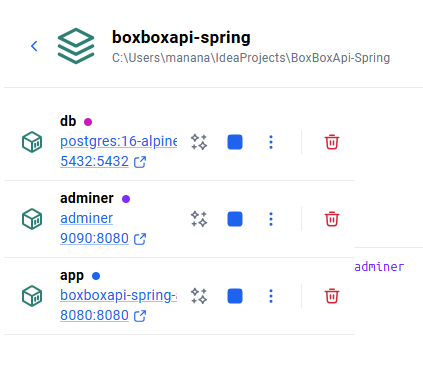
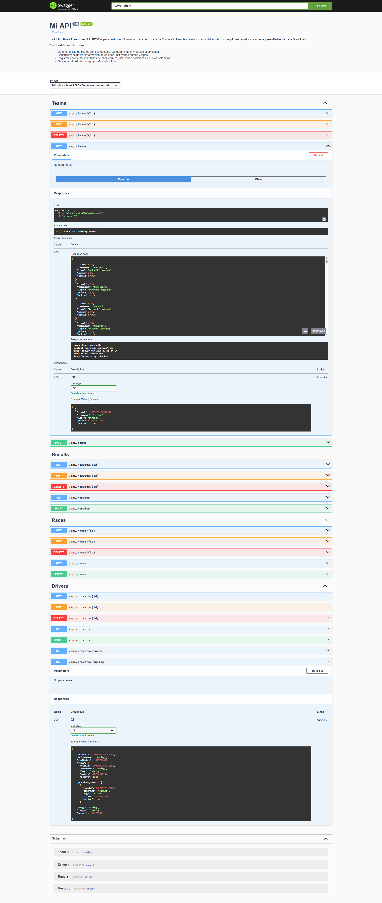
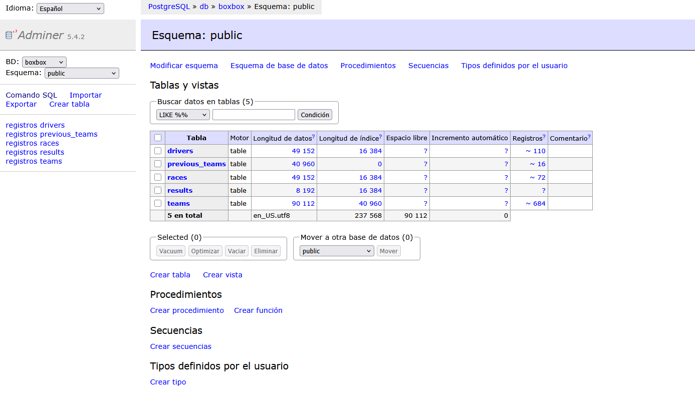

# Infraestructura Docker — Bloque A

## docker-compose.yml
```yaml
services:
  # =====================================================
  # Servicio 1: La aplicacion Spring Boot (pizzeria)
  # =====================================================
  app:
    build: .
    ports:
      - "8080:8080"
    environment:
      - SPRING_DATASOURCE_URL=jdbc:postgresql://db:5432/${POSTGRES_DB}
      - SPRING_DATASOURCE_USERNAME=${POSTGRES_USER}
      - SPRING_DATASOURCE_PASSWORD=${POSTGRES_PASSWORD}
      - SPRING_DATASOURCE_DRIVER_CLASS_NAME=org.postgresql.Driver
      - SPRING_JPA_DATABASE_PLATFORM=org.hibernate.dialect.PostgreSQLDialect
      - SPRING_JPA_HIBERNATE_DDL_AUTO=update
      - SPRING_H2_CONSOLE_ENABLED=false
    depends_on:
      db:
        condition: service_healthy
    restart: on-failure

  # =====================================================
  # Servicio 2: Base de datos PostgreSQL
  # =====================================================
  db:
    image: postgres:16-alpine
    environment:
      - POSTGRES_DB=${POSTGRES_DB}
      - POSTGRES_USER=${POSTGRES_USER}
      - POSTGRES_PASSWORD=${POSTGRES_PASSWORD}
    ports:
      - "5432:5432"
    volumes:
      - postgres_data:/var/lib/postgresql/data
    healthcheck:
      test: ["CMD-SHELL", "pg_isready -U ${POSTGRES_USER}"]
      interval: 5s
      timeout: 5s
      retries: 5

  # =====================================================
  # Servicio 3: Adminer (panel web para ver la BD)
  # =====================================================
  adminer:
    image: adminer
    ports:
      - "9090:8080"
    depends_on:
      db:
        condition: service_healthy

# =======================================================
# Volumenes (para que los datos persistan)
# =======================================================
volumes:
  postgres_data:
```

## Explicación por secciones

### app (Spring Boot)
Esta sección define el contenedor de la aplicación principal. Se construye desde el Dockerfile local y 
expone el puerto 8080. Se configura con variables de entorno para conectarse a la base de datos PostgreSQL y controlar 
el comportamiento de JPA/Hibernate. Además, espera que la base de datos esté saludable antes de arrancar y 
se reinicia automáticamente si falla.

### db (PostgreSQL)
Contenedor de la base de datos. Usa una imagen ligera de PostgreSQL 16. Las credenciales y el nombre de la base
se definen mediante variables de entorno. Se expone el puerto 5432 y se utiliza un volumen persistente para mantener
los datos entre reinicios. Incluye un healthcheck para asegurar que la base esté lista antes de que otros servicios
dependientes se inicien.

### adminer (Panel web)
Servicio opcional para administrar la base de datos vía web. Se conecta a la base de datos y se expone en el
puerto 9090 del host. Solo se inicia si la base de datos está saludable.

### volumes
Define los volúmenes persistentes. En este caso `postgres_data` guarda los datos de PostgreSQL para que no
se pierdan al reiniciar los contenedores.
## Dockerfile

```dockerfile
# ============================================================
# Etapa 1: Compilar con Maven (como hacer mvn package)
# ============================================================
FROM maven:3.9-eclipse-temurin-21 AS builder
WORKDIR /app
COPY pom.xml .
COPY src ./src
RUN mvn clean package -DskipTests

# ============================================================
# Etapa 2: Ejecutar con JRE ligero (solo lo necesario)
# ============================================================
FROM eclipse-temurin:21-jre-alpine
WORKDIR /app
COPY --from=builder /app/target/*.jar app.jar
EXPOSE 8080
ENTRYPOINT ["java", "-jar", "app.jar"]

```

## Explicación Dockerfile

**Etapa 1: Builder**
- Usa `FROM maven:3.9-eclipse-temurin-21 AS builder`, imagen con Maven y JDK para compilar.
- `WORKDIR /app`: carpeta de trabajo dentro del contenedor.
- `COPY pom.xml .`: copia el pom primero para aprovechar cache de dependencias.
- `COPY src ./src`: copia el código fuente.
- `RUN mvn clean package -DskipTests`: compila la aplicación y genera el JAR.

**Etapa 2: Runtime**
- `FROM eclipse-temurin:21-jre-alpine`: imagen ligera solo con JRE.
- `WORKDIR /app`: carpeta de trabajo.
- `COPY --from=builder /app/target/*.jar app.jar`: copia el JAR compilado desde la etapa anterior.
- `EXPOSE 8080`: expone el puerto de la aplicación.
- `ENTRYPOINT ["java", "-jar", "app.jar"]`: comando para iniciar la aplicación.

## Evidencia

### Docker - contenedores



### API corriendo



### Adminer

