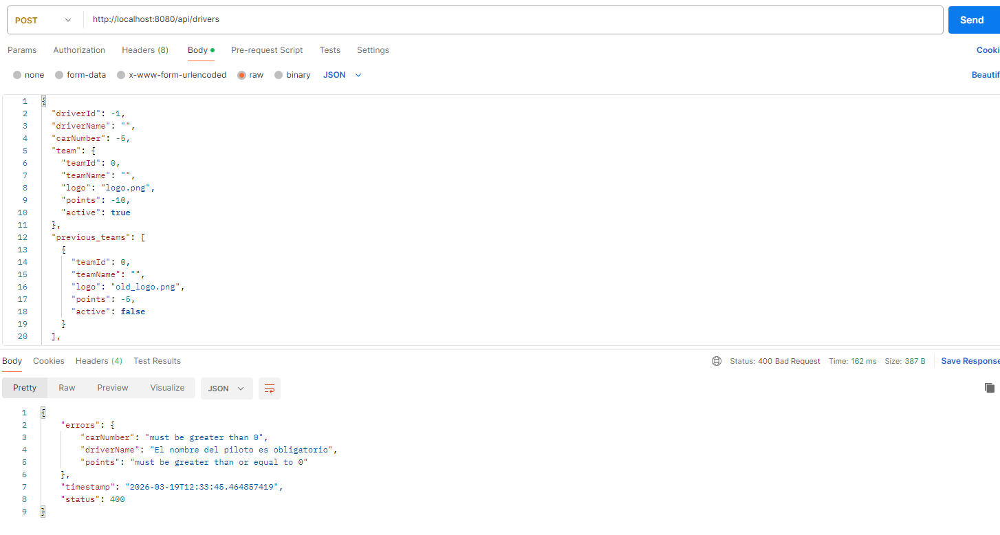

# Resultados — Bloque C

## Opcion elegida
Validación

## Que implementaron
En este proyecto se implementaron validaciones en las entidades principales (**Driver, Team, Race, Result**) usando las anotaciones de **Jakarta Validation**.  
Esto permite garantizar que los datos ingresados por la API sean consistentes y cumplan reglas de negocio básicas antes de persistirlos en la base de datos.

Por ejemplo:
- Los nombres de pilotos y equipos son obligatorios y deben tener entre 2 y 100 caracteres.
- Los números de coche y puntos solo pueden ser positivos o cero.
- La posición de un piloto en una carrera debe estar entre 1 y 22 y los puntos entre 0 y 25.
- Cada resultado debe estar asociado a un piloto y a una carrera.


## Evidencia


## Código relevante
### Driver
```java
@NotBlank(message = "El nombre del piloto es obligatorio")
@Size(min = 2, max = 100, message = "El nombre debe tener entre 2 y 100 caracteres")
@Column(nullable = false)
private String driverName;

@Positive
private int carNumber;

@PositiveOrZero
private int points;
```

### Team
```java
@NotBlank(message = "El nombre del equipo es obligatorio")
@Size(min = 2, max = 100, message = "El nombre debe tener entre 2 y 100 caracteres")
@Column(nullable = false)
private String teamName;

@PositiveOrZero
private int points;

@Column(nullable = false)
private boolean active;
```

### Race
```java
@NotBlank(message = "El nombre de la carrera es obligatorio")
@Size(min = 2, max = 100, message = "El nombre debe tener entre 2 y 100 caracteres")
@Column(nullable = false)
private String raceName;

@ManyToOne
@JoinColumn(name = "winner_driver_id")
private Driver winnerDriver;

@Enumerated(EnumType.STRING)
private RaceStatus status;
```

### Result
```java
@Min(value = 1, message = "La posición mínima es 1")
@Max(value = 22, message = "La posición no puede ser mayor a 22")
private int position;

@Min(value = 0, message = "Los puntos no pueden ser negativos")
@Max(value = 25, message = "Los puntos no pueden superar 25")
private int points;

@NotNull(message = "El piloto es obligatorio")
@ManyToOne
@JoinColumn(name = "driver_id", nullable = false)
private Driver driver;

@NotNull(message = "La carrera es obligatoria")
@ManyToOne
@JoinColumn(name = "race_id", nullable = false)
private Race race;
```


**Explicación:** Las anotaciones de Jakarta Validation aseguran que los datos enviados a la API sean consistentes antes
de guardarlos en la base de datos. Por ejemplo, los pilotos deben tener nombre válido y número de auto positivo; 
los resultados deben tener posiciones entre 1 y 22 y puntos entre 0 y 25. Si un dato no cumple las reglas, 
la API devuelve HTTP 400 con un mensaje descriptivo, garantizando robustez y coherencia en la información.
